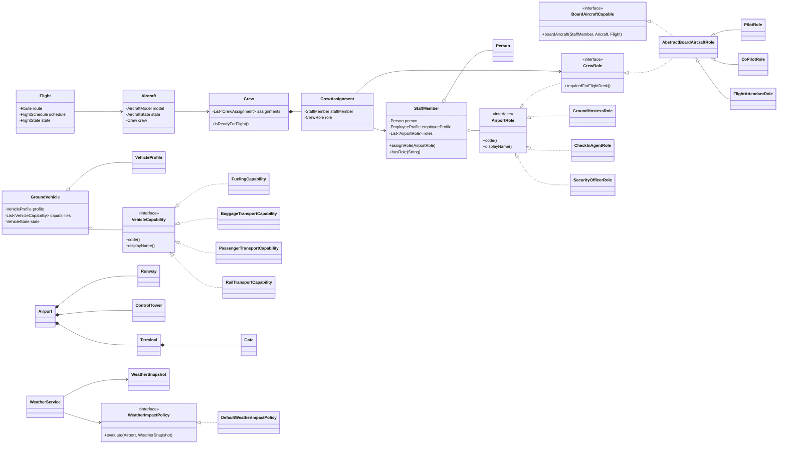
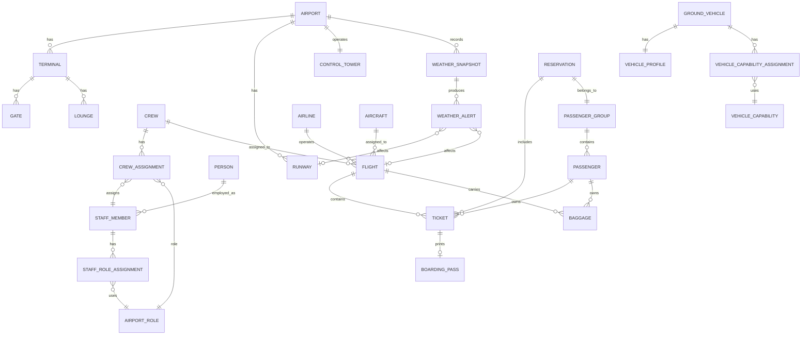

# Airport Simulation CLI

## Problem / Introduction

This project is a Java command-line airport simulation built to train Object-Oriented Programming skills learned at university. It models an airport with flights, aircraft, passengers, reservations, tickets, baggage, crew assignments, check-in, security, customs, immigration, ground operations, parking, lounges, control tower activity, weather, logs, and save/restore.

The design now favors composition over inheritance. For example, a pilot is not a subclass of crew member. A `Person` can be connected to a `StaffMember`, and that staff member can be assigned a `PilotRole`, `CoPilotRole`, `FlightAttendantRole`, `GroundHostessRole`, `CheckInAgentRole`, or `SecurityOfficerRole`.

Portuguese airport role names are documented and mapped to English Java concepts:

- `hospedeira de terra` -> `GroundHostessRole`
- `hospedeira de bordo` -> `FlightAttendantRole`

## Objectives

- Practice OOP design with composition, interfaces, strategies, state objects, repositories, command objects, and services.
- Avoid deep inheritance trees for people, crew, vehicles, and domain types.
- Provide a CLI panel to load data, generate data, start the simulation, manage airport entities, save/restore state, and inspect logs.
- Load airport, flight, and weather data from local CSV files.
- Generate local sample CSV files when external dataset files are not available.
- Simulate real time with configurable multipliers: `x1`, `x2`, `x10`, `x20`.
- Show simulation time, real time, flight status, airport status, and weather details in the CLI.
- Evaluate weather details including temperature, wind, wind direction, gusts, rain, snow, fog, visibility, clouds, thunderstorms, and runway surface condition.
- Support file-based logs grouped by day, with CLI options to read logs by date.
- Save and restore simulation state using a custom JSON parser/writer made in Java.
- Add unit tests and integration tests.
- Run locally with Maven and inside Docker.

## Decisions Taken

- Java target: OpenJDK 25 LTS, released on `2025-09-16`.
- Required runtime target:
  - `OpenJDK Runtime Environment Temurin-25+36`
  - `OpenJDK 64-Bit Server VM Temurin-25+36`
- Build system: Maven.
- IDE: IntelliJ IDEA.
- Maven compiler release: `25`.
- Diagrams: Mermaid diagrams embedded in this README.
- CLI only: no GUI framework.
- Save/restore: project-owned JSON parser and writer, no Gson/Jackson/external JSON libraries.
- Logs: daily files under `logs/`.
- Data: CSV files under `data/import/` or generated sample CSV under `data/generated/`.
- Tests: JUnit 5 unit and integration tests.
- Docker: Eclipse Temurin/OpenJDK 25 image.

## Architecture And Patterns

- Composition for people and roles:
  - `Person` represents human identity.
  - `StaffMember` contains a `Person`, an `EmployeeProfile`, and assigned `AirportRole` objects.
  - `PilotRole`, `CoPilotRole`, and `FlightAttendantRole` are role objects, not person subclasses.
- Interfaces for capabilities:
  - `BoardAircraftCapable`
  - `CheckInCapable`
  - `SecurityCheckCapable`
  - `GroundServiceCapable`
- Abstract class only where shared behavior is useful:
  - `AbstractBoardAircraftRole` contains shared boarding logic for pilot, co-pilot, and flight attendant roles.
- Composition for vehicles:
  - `GroundVehicle` contains a `VehicleProfile` and a list of `VehicleCapability` objects.
  - Fueling, baggage transport, passenger transport, and rail transport are capabilities, not subclasses.
- State Pattern style objects:
  - `FlightState`
  - `GateState`
  - `RunwayState`
  - `BaggageState`
  - `SimulationLifecycleState`
- Strategy Pattern:
  - `WeatherImpactPolicy`
  - `DefaultWeatherImpactPolicy`
- Repository Pattern:
  - `Repository`
  - `InMemoryRepository`
  - `WeatherRepository`
- Command Pattern:
  - `CliCommand` powers menu actions.

## Data Sources

Place user-provided dataset CSV files in the repository under:

- `data/import/world-airports.csv`
- `data/import/airlines-flights.csv`
- `data/import/weather.csv` if available

The project can be extended to use these downloaded Kaggle datasets:

- World Airport Dataset: https://www.kaggle.com/datasets/sanjeetsinghnaik/world-airport-dataset
- Airlines Flights Data: https://www.kaggle.com/datasets/rohitgrewal/airlines-flights-data

If those files are not available, the application can generate sample files:

- `data/generated/airports.csv`
- `data/generated/flights.csv`
- `data/generated/weather.csv`

## OOP UML Class Diagram



## ER Diagram



## Weather Simulation

Weather is represented by `WeatherSnapshot` and evaluated by `WeatherService` through `WeatherImpactPolicy`.

Tracked fields:

- temperature Celsius
- feels-like temperature
- wind speed
- wind gust speed
- wind direction in degrees
- compass wind direction
- rain intensity
- snow intensity
- hail
- thunderstorm
- visibility meters
- fog
- cloud coverage
- cloud ceiling
- runway surface condition
- operational severity

Weather can produce alerts for crosswind, heavy rain, snow, ice, low visibility, fog, and thunderstorms.

## CLI Panels

Main panel:

1. Load data from CSV.
2. Generate sample CSV data.
3. Start simulation.
4. Restore previous simulation.
5. View logs by day.
6. Exit.

Simulation panel:

1. Change time multiplier.
2. Manage crew.
3. Manage passengers and reservations.
4. Print tickets and boarding passes.
5. View weather details.
6. View checks, baggage, and ground operations.
7. Save current simulation.
8. Return to main panel.

## Run Locally

```bash
mvn test
mvn verify
mvn package
java -jar target/airport-simulation-cli-1.0.0.jar
```

## Run With Docker

```bash
docker build -t airport-simulation-cli .
docker compose run --rm airport-simulation
```

Mounted runtime directories:

- `data/`
- `logs/`
- `saves/`

